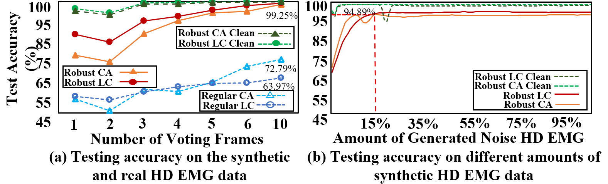

# [IEEE NER 2023] Toward Robust High-Density EMG Pattern Recognition using Generative Adversarial Network and Convolutional Neural Network Implementation

## Abstrct
High-density electromyography (HD EMG)-based Pattern Recognition (PR) has attracted increasing interest in real-time Neural-Machine Interface (NMI) applications because HD EMG can capture neuromuscular information from one temporal and two spatial dimensions, and it does not require anatomically targeted electrode placements. In recent years, deep learning methods such as Convolutional Neural Networks (CNNs), Recurrent Neural Networks (RNNs), and hybrid CNN-RNN methods have shown great potential in HD EMG PR. Due to the high-density and multi-channel characteristics of HD EMG, the use of HD EMG-based NMIs in practice may be challenged by the unreliability of HD EMG recordings over time. So far, few studies have investigated the robustness of deep learning methods on HD EMG PR when noises and disturbances such asmotion artifacts and bad contacts are present in the HD EMGsignals. In this paper, we have developed RoHDE – a Robustdeep learning-based HD EMG PR framework by introducinga Generative Adversarial Network (GAN) that can generatesynthetic HD EMG signals to simulate recording conditionsaffected by disturbances. The generated synthetic HD EMGsignals can be utilized to train robust deep learning modelsagainst real HD EMG signal disturbances. Experimental resultshave shown that our proposed RoHDE framework can improvethe classification accuracy against disturbances such as contactartifacts and loose contacts from 64% to 99%. To the best of our knowledge, this work is the first to address the intrinsicrobustness issue of deep learning-based HD EMG PR.

## Overall Achitecture
<object data="OverallAchitechture.pdf" type="application/pdf" width="700px" height="700px">
    <embed src="OverallAchitechture.pdf">
        
This browser does not support PDFs. Please download the PDF to view it: <a href="OverallAchitechture.pdf">Download PDF</a>.

    </embed>
</object>
## Experiment Result

## 